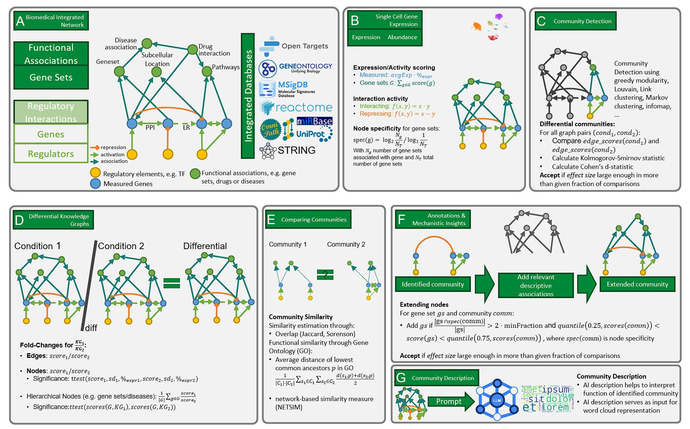

**********************************
Welcome to PICASO's documentation!
**********************************

**PICASO** is a Python library for **P**rofiling **I**ntegrative **C**ommunities of **A**ggregated **S**ingle-cell **O**mics data (**PICASO**).

Check out the :doc:`usage` section for further information, including
how to :ref:`installation` the project.

.. note::

   This project is under active development.

Abstract
========

Various single-cell modalities covering transcriptomics, epigenetic and spatio-temporal changes in health and disease phenotypes are used in an exploratory way to understand biological systems at single-cell resolution. However, the vast amount of such single-cell data is not systematically linked to existing biomedical data. Networks have previously been used to represent harmonized biomedical data. Integrating various resources of biomedical data in networks  has recently received increasing attention. These aggregated networks can provide additional insight into the biology of complex human diseases at cell-type level, however, lack inclusion of single cell expression data. Here, we present the PICASO framework, which incorporates single-cell gene expression data as an additional layer to represent associations between cell types, disease phenotypes, drugs and genes. The PICASO network includes several standardized biomedical databases such as STRING, Uniprot, GeneOntology, Reactome, OmniPath and OpenTargets. Using multiple cell type-specific instances of the framework, each annotated and scored with their respective expression data, comparisons between disease states can be made by computing respective sub-networks and comparing the expression scores between conditions. Ultimately, these group-specific networks will allow the identification of relevant genes, processes and potentially druggable targets, as well as the comparison of different measured groups and thus the identification of group-specific communities and interactions.

Contents
--------

.. toctree::
    :maxdepth: 1
    :titlesonly:

    usage
    examples
    api
